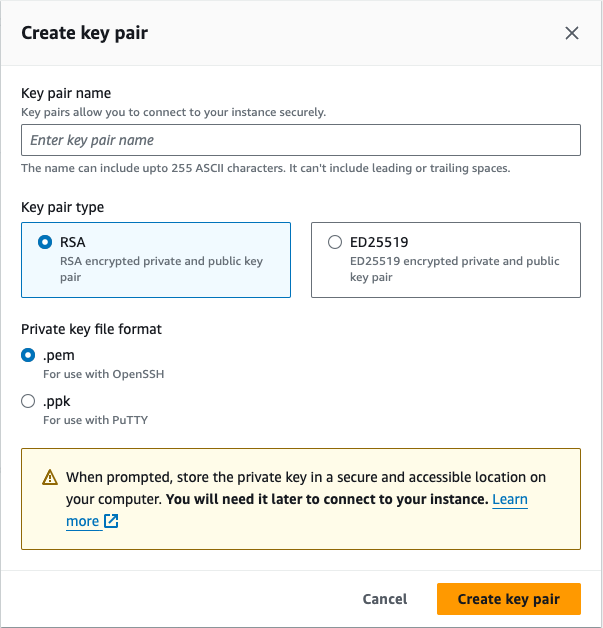

# Connect via SSH

* When creating an EC2 Instance, click on "Create key pair"
* Give the key pair a name
* Select key pair type (RSA or ED25519)
* Select key pair type .pem and click "Create Key Pair"
* Download key and save, rename to remove any spaces from the file name

<figure><figcaption></figcaption></figure>

* In your terminal, navigate to the directory where you downloaded the key file
* Change the file permissions to be read only (you will get an error if you try to use the key and it's permissions are too public)\
  `chmod 0400 keyfile.pem`
* Use the following command to SSH to the instance\
  `ssh -i keyfile.pem ec2-user@xxx.xxx.xxx.xxx`
* The user is always ec2-user
* xxx.xxx.xxx.xxx is the public IP of the instance
