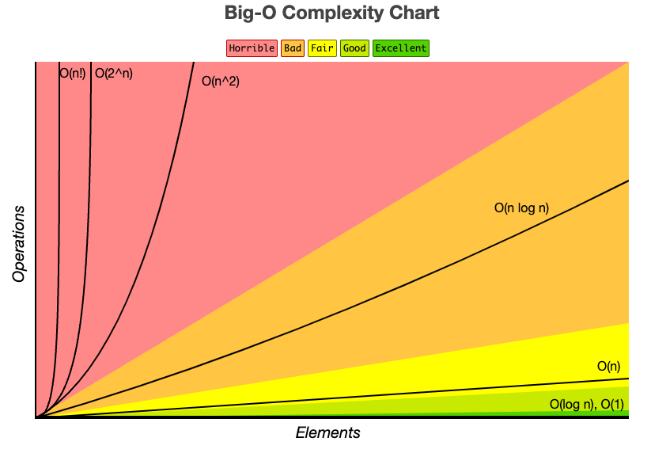

# Big-O

Big-O is a mathematical notation used for describing the time and space complexity of an algorithm as the input size grows.

<figure><figcaption>
bigocheatsheet.com
</figcaption></figure>



Ω = Best case\
Θ = Average case\
O = Worst case

* O (1)
  * Most efficient - as input grows, complexity remains constant
* O(log n)
  * Very efficient - as input grows, complexity remains low, even for large input
  * Divide and Conquer
* O (n)
  * Linear/Proportional - complexity grows inline with input
* O (n log n)
* O (n^2)
  * Loop within a loop
* O (2^n)
* O (n!)
